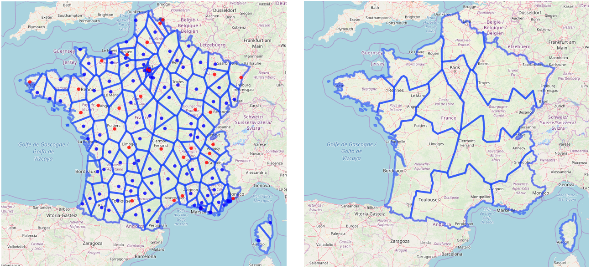

# Introduction

On December 31, 2019, Chinese authorities informed WHO of grouped pneumoniae cases [@WHOalert]. The majority of these cases were linked the Huanan South China Seafood Market, in the city of Wuhan, Hubei province, China. A novel coronavirus, SARS-Cov-2, was identified on January 7, 2020, as the cause of this outbreak. On January 13, the first case outside of China was confirmed in Thailand [@WHOthailand]. The first cases on the European continent were confirmed in France on January 24 [@EurosurvSPF]. The World Health Organization (WHO), declared the outbreak a Public Health Emergency of International Concern on 30 January 2020 [@WHOstatement], and announced a name for the disease on February 11: COVID-19 [@WHOname].

As of March 5, the European Centre for Disease Prevention and Control (ECDC) reported 91,315 COVID-19 confirmed cases in 81 countries, and 3,282 deaths (3.4%). In Europe, 38 countries reported cases, Italy accounting for the majority of them, with 3,089 cases out of 4,290 (72%), and 107 deaths out of 113 (94.7%). France was ranked second with 423 cases and 5 deaths (1.2%) [@SPF5mars].
On March 11, WHO declared a pandemic, as 106 countries reported 118,628 confirmed cases and 4,292 deaths (3.6%) [@WHOpandemic]. In Europe, the number of countries affected increased to 47, Italy still accounting for the majority of cases.[@SPF10mars] 

Figure \@ref(fig:cases) shows the number of cases in metropolitan France from January 22 to March 14 (source Santé Publique France). As of March 10, midnight, 2,030 cases were confirmed, leading to 44 deaths (2.2%) [@SPF10mars]. The two Regions the most impacted were Grand Est and Ile-de-France, with 489, and 468 cases, respectively. People aged over 75 years accounted for 19% of the cases but around 75% of the deaths [@SPF10mars]. As of March 10, 102 cases had been hospitalized into Intensive Care Units (ICU), 38% of them aged 65 years or less. The doubling time is approximately 72h, as the number of cases increased from 1,126 to 2,269 between March 8 and March 11, and from 2,269 to 4,469 between March 11 and March 14. It must be noted that it is likely that the number of confirmed cases is underestimating the true number of cases as all cases are not necessarily identified due to logistical issues in some Regions [@SPF10mars].


```{r}
data <- data.table(openxlsx::read.xlsx("../data-raw/EpiDataFrance.xlsx", 
                                      sheet = "TimeSeries Cases", 
                                      detectDates = TRUE))
data[, Metropole := as.numeric(Metropole)]
data[!is.na(Metropole), France := as.numeric(Metropole)]
data = data[, .(`Country/Region`, France)]
setnames(data, old = "Country/Region", new = "Date")
data[, Date := as.Date(Date, origin = "1899-12-30")]
```

```{r cases, dpi = 150, out.width="80%", fig.align='center', fig.cap="Number of confirmed COVID-19 cases in France from January 22 to March 14"}
ggplot2::ggplot(data, aes(x= Date, y = France)) +
  theme_classic(12) + 
  theme(axis.title.y = element_blank(), axis.title.x = element_blank()) +
  geom_col()

```

SARS-CoV-2 is a zoonotic virus, and bats are believed to be its reservoir. However, human-to-human transmission has been largely reported [@WHOmission]. Transmission occurs mostly via droplets and fomites during close unprotected contact. Information about the main transmission parameters is still relatively scarce, and can vary according to the settings, the data, and the methods used.

The basic reproductive number ($R_0$) was estimated in various studies [@Liu2020;@wu-lancet;@Read2020;@Backer2020;@li-nejm;@Zhao2020;@riou-eurosurv;@Li-medrxiv;@GuanNEJM;@WHOmission;@Zhou2020] starting at 1.4, up to 7.23. Most countries have now implemented control strategies involving contact tracing, quarantine, and isolation measures, which are likely to significantly reduce the $R_0$. Li and colleagues used individually documented case descriptions from China to estimate a reproductive number in the context of control measures ($R_c$) [@Li-medrxiv]. It was estimated to be 1.54. Zhou and colleagues [@Zhou2020] estimated a controlled reproduction number between 1.46 and 2.99. They also estimated mean incubation and contagious periods of 5 and 11 days, respectively. Abbott and colleagues estimated the reproduction number of 24 countries using publicly available data with a 7-day sliding window. Their estimate for France in date of March 13 was between 1.4 and 3.2. [@Abbott]


<!-- |study|time|country|reproduction number|incubation time (days)|generation time (days) -->
<!-- |-|-|-|-|-|- -->
<!-- |Liu et al[@Liu2020]|- 23 Jan|China|2.90 (95%CI: 2.32-3.63) to 2.92 (95%CI: 2.28-3.67)|4.8 ±2.6|- -->
<!-- |Wu et al[@wu-lancet]|31 Dec - 28 Jan|China|2·68 (95% CI 2·47–2·86)|-|- -->
<!-- |Read et al[@Read2020]|1-22 January|China|3.11 (95%CI, 2.39–4.13)|-|- -->
<!-- |Backer et al[@Backer2020]|20-28 January|China|-|6.4 (95% CI, 5.6 – 7.7)|- -->
<!-- |Li et al[@li-nejm]|-22 January|China|2.2 (95% CI, 1.4 to 3.9)|5.2 (95% CI, 4.1 to 7.0)|7.5 (95% CI, 5.3 to 19) -->
<!-- |Zhao et al[@Zhao2020]|10-24 January|China|from 2.24 (95%CI: 1.96–2.55) to 3.58 (95%CI: 2.89–4.39)|-|- -->
<!-- |Riou et al[@riou-eurosurv]|-18 January|China|2.2 (90% CI: 1.4–3.8)|-|- -->
<!-- |Li et al[@Li-medrxiv]|?|China|1.54|7.2 (6.8,7.6)|3.3 (2.3, 4.3) -->
<!-- |Guan et al[@GuanNEJM]|- 20 Jan|China|-|4 (IQR 2-7)|- -->
<!-- |WHO China mission[@WHOmission]|16-24 Feb|China|-|5-6 (range 1-14)|- -->
<!-- |Zhou et al[@Zhou2020]|- 19 Feb|China|range: 1.46 - 2.99 (controlled)|5.33 +- 3.36|4.27 +- 3.44 -->

Several models have already been developed to forecast propagation dynamics of COVID-19 epidemics in various settings. However, models in European context are lacking. Danon and colleagues explored disease transmission in England and Wales by adapting an existing stochastic, metapopulation model. [@danon-medrxiv] Pinotti and colleagues modeled international importation of COVID-19 cases to assess rapidity of isolation, effect of intervention, and undetection rates. [@Pinotti2020] To this date, no models have been developed to analyze COVID-19 propagation dynamics in France.

# Objective

The objective of this study was to estimate the number of COVID-19 cases, hospitalizations and deaths in France, and to assess the impact of the epidemic on healthcare resources, by estimating the number of required hospital beds in ICU throughout the epidemic, for each region. As a sensitivity analysis and to assess the potential impact of large scale control measures, we varied the $R_0$ of the epidemic from 3 to 1.5.

# Methods

We listed the 138 hospitals that are identified as referral centers for the treatment of COVID-19 cases in France. Of those, 33 hospitals are listed as primary referral centers, and 98 as secondary referral centers in metropolitan France and 7 are overseas hospitals (not included). We then divided metropolitan France into hospital catchment areas around these referral hospitals using Voronoi polygons (Figure \ref{maps}). Population structure was inferred for each catchment area from 2016 and 2017 census data provided by the French National Institute of Statistics and Economic Studies (Insee) [@INSEE]. Catchment areas were then aggregated by metropolitan Regions [13 French administrative areas with an averaged population of 4.75 millions ranging from 300,000 (Corse) to 12.55 millions (Ile-de-France)]. Data on ICU beds capacity per French Region were retrieved from the "Statistique Annuelle des Etablissements de Santé" (SAE) [@DREES]. 
```{r , echo=FALSE, fig.cap="Maps of France divided into hospital catchment areas, then aggregated by French Region. \\label{maps}", out.width = '100%'}

```

We developed a deterministic, age-structured, compartmental, Susceptible-Exposed-Infectious-Removed (SEIR) model, as a set of differential equations (Figure \ref{diagram}). The population was divided into 17 age-groups (5 years age-band), and can be either susceptible (S), exposed to the virus but not infectious (E), infected and infectious (I), or removed from the chains of infection (R). We used an inter-individual contacts matrix for the French population estimated by Prem and colleagues [@Prem2017] to simulate age-dependent mixing.

```{r , echo=FALSE, fig.cap="Diagram of the age-structured SEIR model. \\label{diagram}", out.width = '100%'}

```

We considered an incubation period of 5 days and a contagious period of 11 days [@Zhou2020]. We assumed an average length of stay in hospitals and in ICU wards of 15 days for all patients, of all ages. We estimated the age-dependent susceptibility of the population based on the age distribution of infected cases reported by Wu and colleagues in China [@wu-lancet]. We standardized the Chinese age distribution of cases to the French population to estimate the expected age distribution of cases for France. We then fitted the age dependent susceptibility vector using the R implementation of the subplex algorithm provided by the `nloptr` package.

Based on the estimated number of new cases per day, we inferred different outcomes. First, we computed the number of severe cases, defined according to Guan and colleagues [@GuanNEJM]. We used their estimations of age-dependent severity risks across four age groups, which were dispatched across our 17 age groups. We also estimated the number of cases which will require hospitalization to ICU using age-dependent risks from Guan and colleagues [@GuanNEJM]. We also estimated the number of cases which will require mechanical ventilation using data from Yang and colleagues [@Yang-lancet] (not age-dependent). The number of deaths was estimated using age-dependent deaths risks (10 age groups) provided by the Italian National Institute of Health (Istituto Superiore di Sanità) [@death].

The transmission model was implemented in `C++`. Data collection, data management, model runs, and results analysis and reporting were performed using R. All data and source code were bundled into an R package and a Shiny application was developed to run the model with different parameters, and to explore the various results (available upon request).
